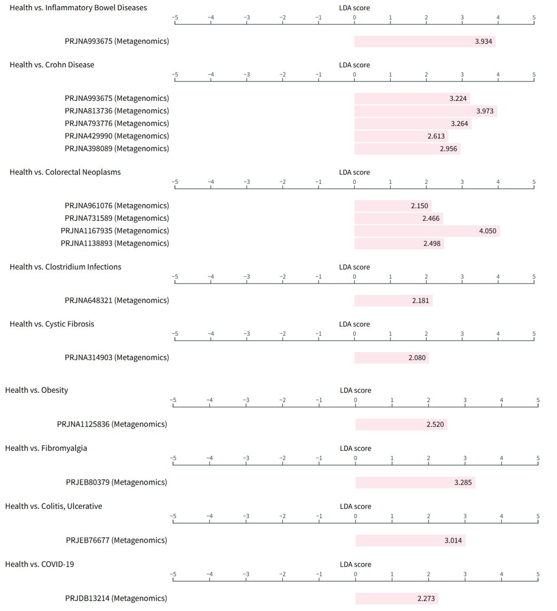
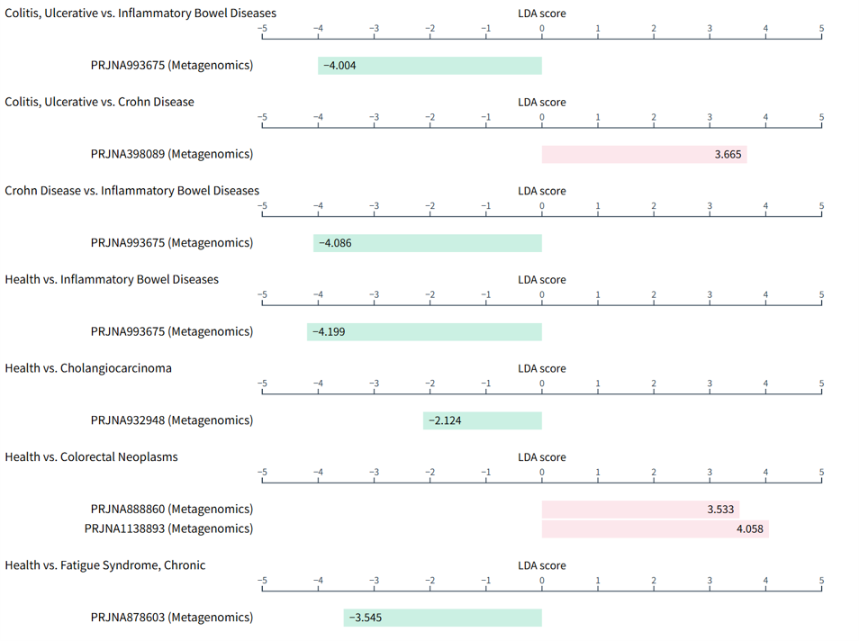
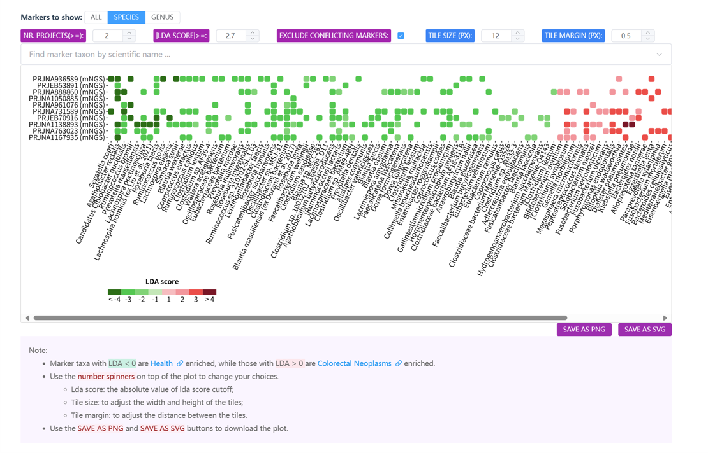

# Cross-project comparisons for disease markers

**GMrepo** currently supports two types of cross-project comparisons for disease markers. See details below.

## Cross-project and phenotype comparison for a marker taxon

This purpose of this comparison is to show whether a specific taxon:

- Is unique to a disease, or shared across multiple diseases
- Has the same trend across diseases (e.g., always enriched in disease- or health-associated samples), or shows different trends
- Has the same trend in multiple projects of the same disease, or conflicting trends across projects

Here we use two examples to explain what the `above purposes` mean.

### 1. *Fusobacterium nucleatum*

[Fusobacterium nucleatum](https://gmrepo2025.humangut.info:8443/taxon/851) is a known marker for colorectal cancer (CRC).  
In **GMrepo**, we show that it is also a marker for multiple diseases, including:

- Inflammatory Bowel Diseases
- Crohn Disease
- COVID-19
- Clostridium infections

In addition, it shows consistent trends as a `disease-enriched` marker:

- Not only across the diseases listed above
- But also across multiple projects within the same disease, such as:
  - Crohn Disease
  - Colorectal Neoplasms (CRC)

### 2. *Dialister invisus*

[Dialister invisus](https://gmrepo2025.humangut.info:8443/taxon/218538) is also a marker species for multiple diseases:

<!--
However, it shows inconsistent trends — not only between diseases (e.g., enriched in `Adenoma` but depleted in `Crohn Disease`), but also across projects within the same disease (e.g., `Autism Spectrum Disorder`, `Colorectal Neoplasms`).
-->
However, it shows inconsistent trends between diseases.

## Marker taxa of a disease across multiple projects

In **GMrepo**, a disease may be studied in multiple datasets/projects.  
To support comparison across those projects, a dedicated page is available for each phenotype pair (e.g., health vs. liver cirrhosis, or adenoma vs. colorectal cancer), showing both consistent and inconsistent disease-associated microbial markers.

Users can check the [Phenotype comparisons page](https://gmrepo2025.humangut.info:8443/phenotypes/comparisons) for all available `phenotype pairs`.

<!--
Below is an example demonstrating consistent and inconsistent markers across projects.
-->
Below is an example.

###  [Colorectal Neoplasms (CRC)](https://gmrepo2025.humangut.info:8443/phenotypes/comparisons/D006262/D015179)

In addition to project details and a data table of identified CRC markers (vs. healthy), a **tile view** is used to visualize markers stratified by project:

Shown above are microbial markers across ten CRC-related projects.  
<!--
It is evident that several disease-enriched markers are consistent across projects, including:

- *Fusobacterium nucleatum*
- *Parvimonas micra*
- *Gemella morbillorum*
-->

