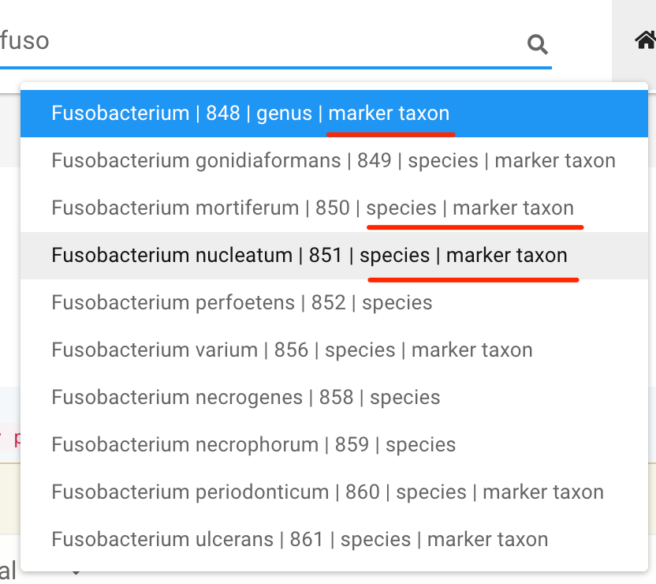

# Find a marker species/genus of interests
<!--
There are at least two ways to find a marker taxa of interest.

## 1. Use the global search widget

A global search widget is available on the navigation bar next to the **GMrepo** logo:

{ width=60%; }

Possible hits will be shown automatically in a dropdown list when users enter three and more characters:

{ width=40%; }

Those marked as `marker taxon` at the end are `marker taxa`. Users can then select any item from the list, and go to the `marker taxon` of interest.

!!! note
    * The search is automatic, so there is no need to press the <code>enter</code> key or click the <code>search</code> icon.  
    * <code>Nothing will be shown</code> if no search results can be found in our database.
-->
## Search in the [Marker taxa](https://gmrepo2025.humangut.info:8443/taxon/marker) webpage

Users can first go to the [Marker taxa](https://gmrepo2025.humangut.info:8443/taxon/marker), and search in the <code>Species</code> or <code>Genus</code> tables:

!!! tip
    Valid search terms:
    
    * scientific name, for example `fusobacterium`
<!--   * NCBI taxonomic ID, for example `851`--> 

