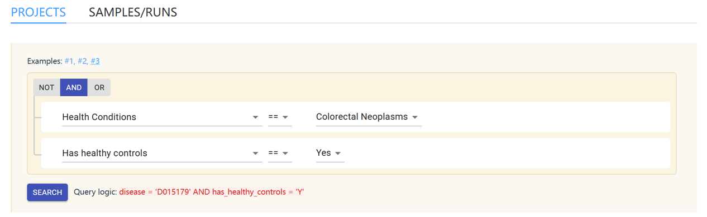

# Use the graphic data selector

**GMrepo** is equipped with **two graphical data selectors** to allow users to quickly build complex queries to find **projects** and **runs** of interest; see below:

The selectors are a bit difficult to start with, so we provided six examples. Users can click one of the links **`Examples: #1, #2, #3`** above the selectors to view:

* the purpose of the search, e.g., `"get runs from healthy people aged 18–60"`,
* the selector setup, and 
* query logic in SQL command string: `"disease = 'D006262' AND host_age BETWEEN 18 AND 60"`.

## Build complex queries using the data selector

It is very easy to use the data selectors. There are three basic logics to build an efficient query:

* AND,
* OR, and
* GROUP to modify the orders of the logics.

For example, to search for samples that were taken from `healthy individuals` that are **either** American **or** British, we need to:

  * a. First build a group logic using the **ADD GROUP** button that defines the target population.
  * b. Then add two rules using the **ADD RULE** button that set `Country` to `United States of America` **OR** `United Kingdom`.
    * **Note** the logic between two rules on the `Country` is **OR**!
  * c. Then add a new rule **parallel** to the above group, and use it to select `Phenotype` as `Health`.
    * **Note** the logic between the `Phenotype` and the `Country` group is **AND**!

The resulting graphical selector and the query logic are shown below:

## Examples

!!! example "Get runs with Irritable Bowel Syndrome"
    

!!! example "Get runs from Australia with age"
    

Data selector examples for projects:

!!! example "Get projects contain both CRC patients and healthy controls"
    

!!! example "Get projects contain healthy people"
    

!!! example "Get projects contain more than 50 Irritable Bowel Syndrome patients"
    

More examples will be added in the future.

