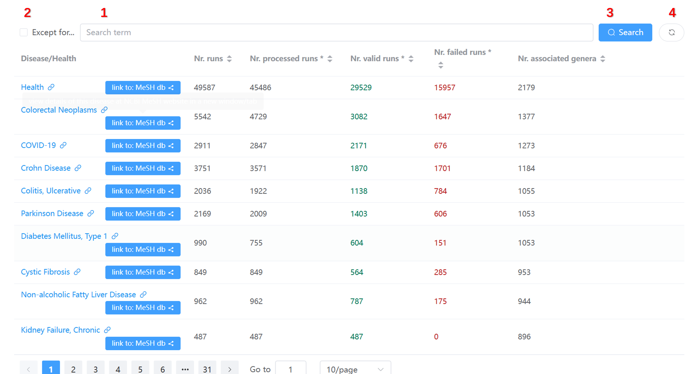
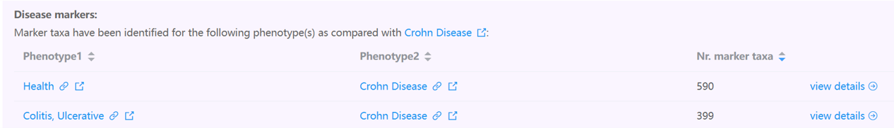
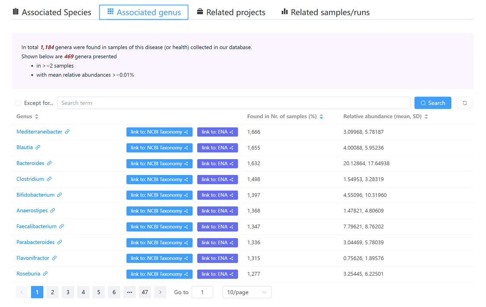
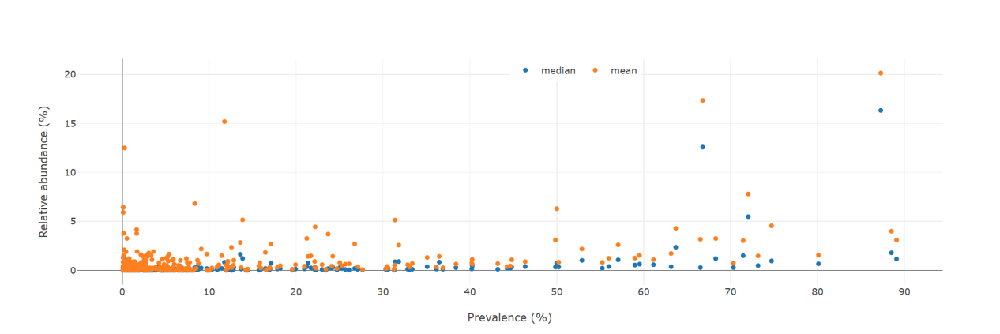
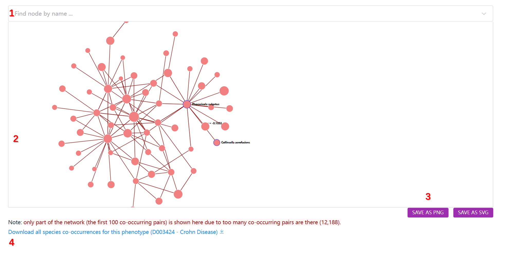

# Disease-centric pages

There are in total **three** types of disease-centric web pages that are designed to present disease-related information, which are detailed below:

## [Phenotypes (diseases and health) page](https://gmrepo2025.humangut.info:8443/phenotypes)

This page lists all diseases that have been associated with alterations in gut microbes.

Its main content is a table listing statistics of 302 diseases collected in our database:

In addition to the data table, several control widgets are available on the top of the table (marked by the red box). Users can use them to filter and search for information of interest.

!!! note "Widgets to filter the table contents"
    The widgets in the above screenshot are:

    1. Filter the table using user-supplied keywords;
    2. Filter the contents that do **not** contain the keywords;
    3. Do filtering;
    4. Clear search results and reset the table.

Clicking any disease name redirects users to a dedicated page for disease–gut microbe associations.

---

## Gut microbes associated with a specific disease

This page describes in detail the gut microbiota associated with a specific disease.

Below, the [Crohn Disease](https://gmrepo2025.humangut.info:8443/phenotypes/D003424) page is used as an example.

### 1. Overview of `Crohn Disease`-associated gut microbiota data

This section gives a brief description of the disease (or health) from the MeSH database, and summarizes:

<!--- number of related projects;-->
- number of total runs in those projects;
- number of processed runs (quality checked and analyzed);
- number of valid runs that passed [quality control procedures](../materialsandmethods/dataprocessingandqc.md).

---

### 2. Overview of disease markers

This section includes a table listing the number of marker taxa identified between:

- either `Crohn Disease` and controls,
- or between stages of `Crohn Disease` (if applicable).

!!! note
<!--
    - **Control Groups** and **Health** are two MeSH terms often used to describe control samples. 'Health' means no detectable diseases, while 'Control Groups' refers to individuals not having the specific disease of interest.
-->
    - The **'Nr. marker taxa'** column shows the total number of markers at genus and species levels. If markers were found in multiple projects, the **unique** count is shown.

---

### 3. Four tables listing species, genera, projects, and runs

This section includes:

- species identified in valid runs associated with `Crohn Disease`, with prevalence and abundance;
- genera identified similarly;
- related project metadata and publications (if available);
- related runs and their QC status.

Each table includes widgets for searching and filtering.

---

### 4. A dot plot summarizing taxon abundance vs. prevalence

Each dot represents a taxon.

!!! note
    - **Prevalence**: proportion of samples where a taxon is found above a threshold (e.g. 0.01%).
    - **Abundance**: mean/median relative abundance in phenotype samples (e.g., `Crohn Disease`).

---

### 5. A network plot of co-occurred taxa

!!! info "Main components"
    1. A search/select widget to find and center on taxa;
    2. The co-occurrence network;
    3. Buttons to export the network as PNG or SVG;
    4. A download link for raw co-occurrence data.

!!! info "The network"
    - **Nodes**: species or genera that co-occur with others; node size ∝ number of connections.
    - **Edges**: co-occurrence relationships; width ∝ Pearson correlation strength, color = green (positive), red (negative).

!!! info "Criteria for co-occurrence"
    Two taxa are considered co-occurred in `Crohn Disease` samples if:

    1. **Fisher's exact test** on presence/absence (abundance > 0.01%) yields p < 0.05;
    2. **Pearson correlation** of abundance values yields p < 0.05;
    3. **Spearman correlation** of abundance values yields p < 0.05.

!!! note "Usage of the network plot"
    - Hover: highlight node and neighbors, show names
    - Click: highlight node and neighbors
    - Drag: move node, fade other nod

