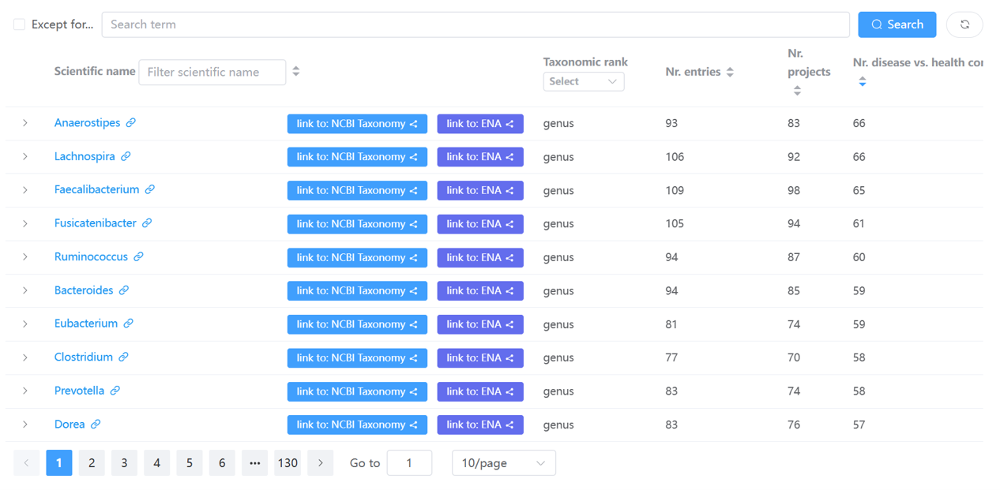

# Disease markers webpages

A `marker taxon` refers to a genus or species that showed significantly differential abundances between two different groups (e.g., cases vs. controls or different disease stages such as adenoma vs. CRC) using 
[LEfSe (Linear discriminant analysis effect size)](https://www.ncbi.nlm.nih.gov/pubmed/21702898).

Marker taxa were identified on a per-project basis for [*curated projects*](https://gmrepo2025.humangut.info:8443/data/curatedProjects).

Please consult the [*'identification of disease markers in curated projects'* webpage for more details](../materialsandmethods/indepthanalyses).

In total there are **three** types of webpages :fontawesome-solid-book-open: for disease markers, which are explained in detail below.

## fontawesome-solid-book-open: [All disease markers](https://gmrepo2025.humangut.info:8443/taxon/marker)

This page lists all markers identified in  
<b>GMrepo</b> in a table:

!!! tip
    - Users can use the widgets on top of the table to search and filter the table.  
    - Users can click any of the taxon names to view more details, including associated disease(s) and their abundance alterations (i.e., enrichment or depletion) in disease samples as compared with healthy controls, or in samples of different disease stages.

## fontawesome-solid-book-open: Detailed info on a marker taxon

This page has been merged into the **'marker taxon'** section of the `taxon details` page;  
see [this example](https://gmrepo2025.humangut.info:8443/taxon/851) and [documentation](microbecentricpages).

## fontawesome-solid-book-open: Markers identified in a curated project

This page has merged into the **'In-depth analysis'** section of a `project details` page.  
See [this example](https://gmrepo2025.humangut.info:8443/data/project/PRJNA658160) and [documentation](projectandrunpages).

