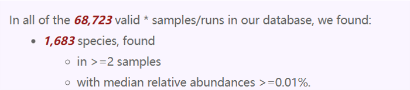
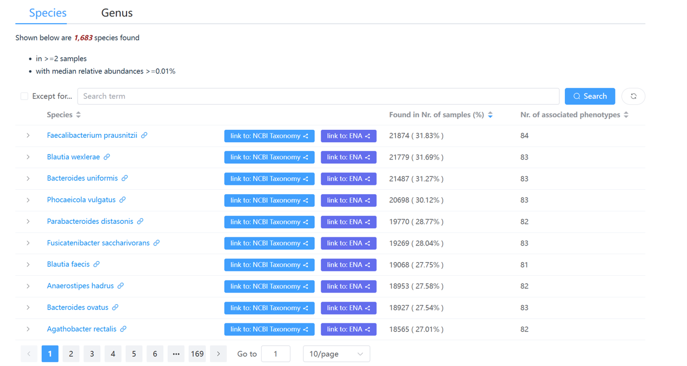
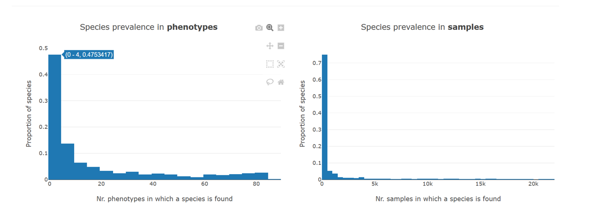
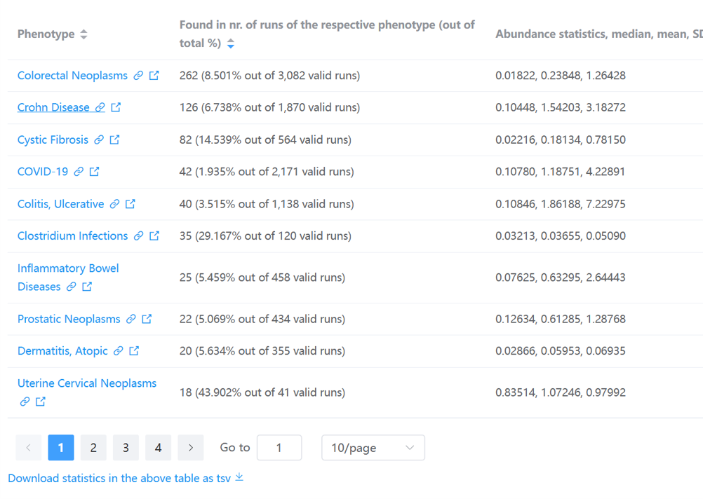
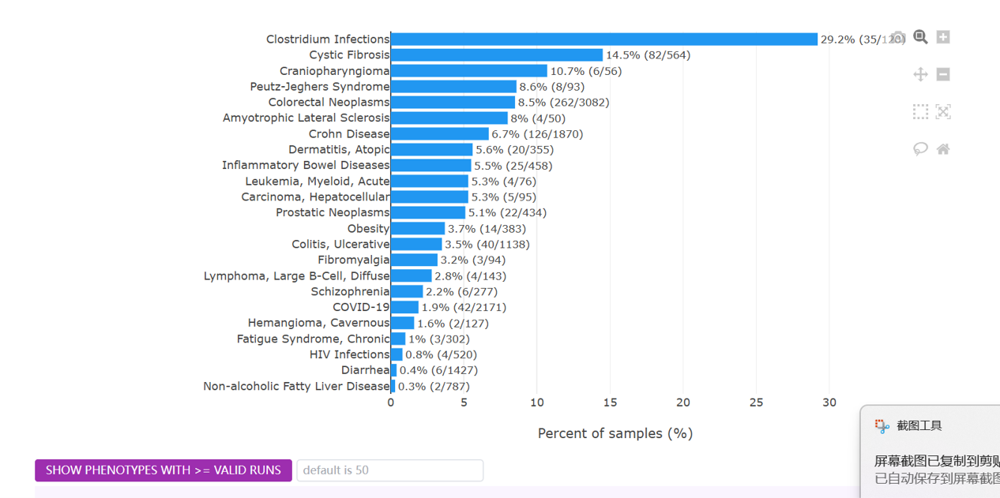
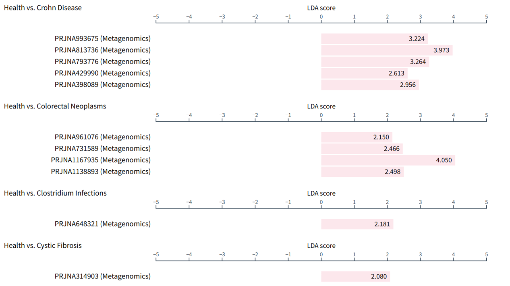

# Gut microbe centric pages

Similar to [disease centric pages](../diseasecentricpages), there are **two types** of gut microbe centric webpages :fontawesome-solid-book-open:, i.e., the information is organized around the microbe(s), including:

- the [gut microbes page](https://gmrepo2025.humangut.info:8443/taxon) that lists all gut microbes identified in the qualified samples collected in  <b>GMrepo</b>,
- the [single taxon page](https://gmrepo2025.humangut.info:8443/taxon/820) that lists its associated diseases and distributions across diseases. If a taxon is a disease marker, the relevant information will also be included.

These pages will be described in detail below.

## fontawesome-solid-book-open: [All gut microbes](https://gmrepo2025.humangut.info:8443/taxon)

This page lists all gut microbes at species and genus levels included in  
<b>GMrepo</b>. It consists of three sections.

### 1. Overview

This part provides simple statistics on the gut microbes collected in our database, for example:

### 2. Lists of all gut microbes

This part contains two data tables that list all gut microbes at species and genus levels respectively, and their associated phenotypes (i.e., diseases and health).

Users can click any of the taxa to view [all relevant information of the taxon in our database in more detail](#all-data-of-a-specific-taxon).

!!! tip
    - Because there are so many identified species (genera), this table lists a subset of which that are found in two or more samples with median relative abundances >= 0.01%.  
    - Users can use the widgets above the data table to search and filter the contents of the table. For example, users can enter a search term `Bacteroides` to find all species that contain **Bacteroides** in their names.
<!--
!!! note
    - A star symbol :fontawesome-regular-star: next to taxon names indicates marker taxon, which shows significantly differential abundances between two phenotype types, e.g., health vs. disease. See the [marker taxon page](diseasemarkerpages.md) for details. 
-->

### 3. Statistics on taxon prevalence in phenotypes and samples

This part contains two histograms.

The first shows the distribution of the taxa in the phenotypes, while the second shows distribution of all the taxa in the samples.

For example, the first bar in the left panel means that about **47.5% of all species** are found in **four or fewer (0–4) phenotypes**.

## fontawesome-solid-book-open: Detailed information on a specific taxon

This webpage contains almost all information on a taxon in our database, including:

- its association with diseases,
- its prevalence and abundances across diseases,
- whether it is a marker, in how many diseases it serves as a marker, and its trends (i.e., enrichment and depletion) in diseases and healthy controls.

Here we use [`Fusobacterium nucleatum`](https://gmrepo2025.humangut.info:8443/taxon/851) as an example to show the contents of this page.

### 1. Overview 

This part summarizes very briefly the number of runs in which `Fusobacterium nucleatum` can be found, and the number of phenotypes (diseases and health) it is associated with.

It also includes links to external databases, including:

- <a href="https://www.ncbi.nlm.nih.gov/Taxonomy/Browser/wwwtax.cgi?mode=Info&id=851" target="_blank">NCBI taxonomic database</a>
- <a href="https://www.ebi.ac.uk/ena/browser/view/Taxon:851" target="_blank">ENA taxonomic database</a> (if available)

### 2. Stats on associated phenotypes

This part contains a table and a barplot.

The table lists the associated diseases and the prevalence of ***Fusobacterium nucleatum*** in the corresponding disease-associated samples.

Users can click a disease name, e.g., `Crohn Disease`, to view [more information on gut microbes associated with the disease in our database](https://gmrepo2025.humangut.info:8443/phenotypes/D003424).

The barplot shows basically the same statistics:

!!! tip
    - By default, phenotypes with more than `50 valid runs` will be included in this barplot.  
    - Users may increase/decrease this threshold using widgets above.  
    - Here `prevalence` is defined as percentage of runs in which the current taxon is present (with relative abundance >= 0.01%) out of valid runs.

### 3. Relative abundances of the taxon in different diseases and healthy samples

The relative abundances of the taxon across diseases and health are shown in:

- a density plot, and  
- a boxplot.

See [this example](https://gmrepo2025.humangut.info:8443/taxon/851).

### 4. Marker taxon

[Please consult the marker identification documentation for more details on how markers are identified](/materialsandmethods/indepthanalyses).

!!! note
    The markers are identified on a per-project basis, and between:
    
    - either a disease and health (e.g., colorectal cancer (CRC) vs. healthy controls),  
    - or different stages of the same disease (e.g., CRC and adenoma)

In  
<b>GMrepo</b>,  
marker information in this microbe-centric page is presented using a table and a barplot.

As shown below is the barplot view of [`Fusobacterium nucleatum` as a marker taxon](https://gmrepo2025.humangut.info:8443/taxon/851):

!!! note
    - From this plot we can see that `F. nucleatum` has been identified as a marker in many diseases.  
    - It shows consistent enrichment in diseases as compared with healthy controls<!--, and in more advanced disease stages (e.g., adenoma vs. CRC)-->.  
    - It also shows consistent trend in multiple projects related to the same disease (e.g., Colorectal Neoplasms (CRC)).

