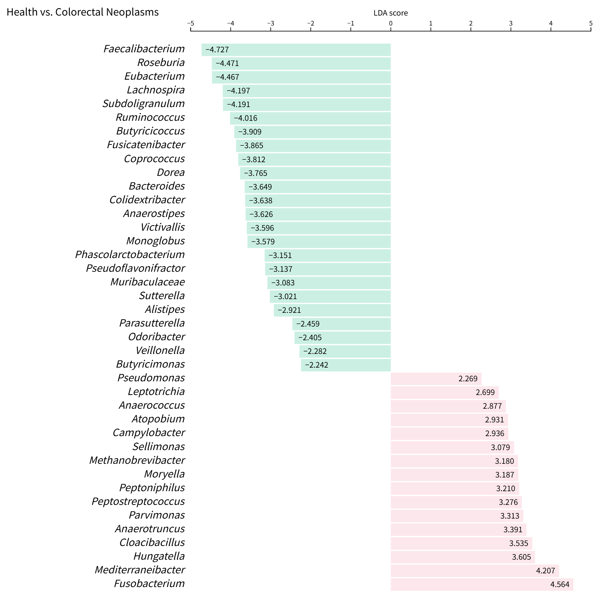
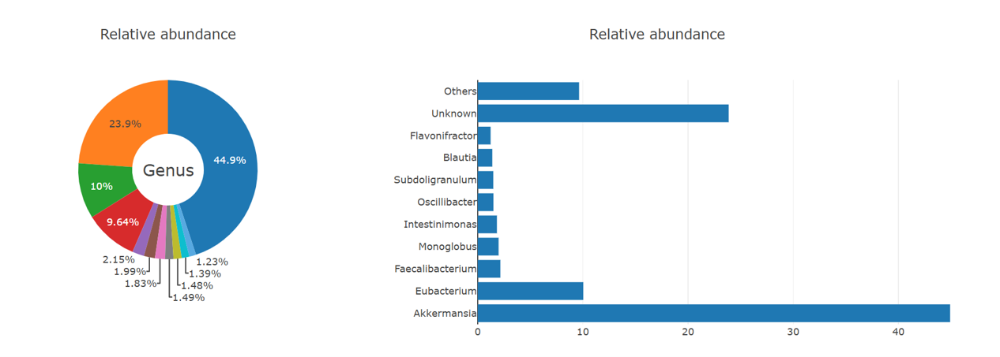

# Projects and runs

The `projects and runs` webpages can be found from the **Data** menu, which contains two submenus: one for [all projects and runs](https://gmrepo2025.humangut.info:8443/data), the other for [curated projects](https://gmrepo2025.humangut.info:8443/data/curatedProjects).

There are four types of **book-open** webpages for `projects and runs`.

## All projects and runs

This page provides statistics on the data collected in **GMrepo**, and lists all **projects** and **runs** in two tables. From these tables, users can access webpages with details of specific projects or runs.

It consists of three parts:

### 1. Overview

This part provides an overview of data collected in our database. For example, the current release contains:

* Meta data for a total of 118,865 runs (samples), belonging to 890 projects.
  Among these, raw data have been processed for 108,177 runs (samples), belonging to 884 projects.
* Microbe abundance data are available for 68,723 runs (samples), belonging to 664 projects.
* A total of 39,452 runs (samples), belonging to 472 projects failed our QC processes.
* In addition, **GMrepo** includes information on 6 projects whose raw data were not processed, mostly due to the lack of clearly defined health/disease information.

### 2. All projects table

This table lists collected projects, their associated diseases, related publications, brief descriptions, and whether the raw data have been processed.

Raw data of a project will not be processed if essential meta-data are missing.
<!-- For example, **GMrepo** currently contains 76 projects whose raw data were not processed, totaling 31,381 runs/samples, mostly due to lack of phenotype information; users can click the project ID for details.

For example, project [PRJNA682076](https://gmrepo.humangut.info/data/project/PRJNA682076) contains `666` samples/runs; it was not processed because host-related information was unavailable, including `disease/health information, age, gender, and BMI`.
-->

### 3. All runs table

This table contains a list of collected samples in **GMrepo**, including meta-data such as:

* Technical meta-data:
  * Experiment type (16S or Metagenomics),
  * Sequencing devices/instruments,
  * Number of obtained sequencing reads.

* Host-related, biologically relevant meta-data:
  * Disease or health status (referred to as `phenotype` in our database),
  * Age,
  * Sex,
  * BMI (body mass index),
  * Antibiotic usage.

Meta data are available for a total of `118,865` runs/samples.

Each run has a QCStatus (quality control result), which can be:

* 1: data passed QC and processed results have been loaded,
* 0: data did NOT pass QC,
* (empty): data yet to be processed.

Please consult [Data processing & QC](../materialsandmethods/dataprocessingandqc) for more details.

## Project details page

The project details page provides information about each collected project, including:

* Included samples,
* Associated disease(s),
* Related publication(s),
* Disease marker analysis results.

Here are some examples:

* [PRJNA398089](https://gmrepo2025.humangut.info:8443/data/project/PRJNA398089)
* [PRJNA658160](https://gmrepo2025.humangut.info:8443/data/project/PRJNA658160)
* [PRJNA562327](https://gmrepo2025.humangut.info:8443/data/project/PRJNA562327)

### 1. Project overview

This part provides basic information about a project, including:

* A brief project description obtained from public databases, mostly from
  - [ENA (European Nucleotide Archive)](https://www.ebi.ac.uk/ena/browse)
  - [NCBI SRA (Sequence Read Archive)](https://www.ncbi.nlm.nih.gov/sra)
* Number of included runs,
* Related publication(s), if available.
<!--* Whether the project is a [curated project](https://gmrepo2025.humangut.info:8443/data/curatedProjects).-->

### 2. Associated runs/samples

This section includes a table of runs/samples with meta-data and QCStatus, similar to the all runs table.

### 3. In-depth analysis

`In-depth analysis` currently includes only `marker identification`. See our documentation on [Disease marker identification](../materialsandmethods/indepthanalyses) for more.

Briefly, microbial markers showing significantly different abundance between:

* Disease and healthy controls (e.g., CRC and healthy),
* Or between disease stages (e.g., adenoma and CRC),

are identified using `LEfSe (Linear discriminant analysis effect size)`  
[PMID: 21702898](https://www.ncbi.nlm.nih.gov/pubmed/21702898).

Markers are identified per project and included in the project details page.

LEfSe results are shown in tables and visualized by barplots, e.g.:

This plot shows marker species with `|LDA score| >= 2.0` between CRC and healthy controls in project [PRJEB46665](https://gmrepo2025.humangut.info:8443/data/project/PRJEB46665), where green bars indicate health-enriched species and pink bars indicate CRC-enriched species.

> **Note:**  
> * For whole-genome shotgun sequencing (mNGS) projects, markers are identified at both species and genus levels.  
> * For 16S amplicon data, markers are identified only at genus level.  
<!--
>> * Users can toggle to show species, genus, or both markers via controls above the barplot.

-->

## Run details page

This page shows details of a specific run, including:

### 1. Run details and meta-data

* Run ID,
* Brief introduction,
* Related project ID and sample ID,
* Associated disease,
* Meta-data.

### 2. Taxonomic profile

This part shows the bacterial species/genus identified and their relative abundances.

See [ERR6617404](https://gmrepo2025.humangut.info:8443/data/run/ERR6617404) for example.

The relative abundances are visualized as below:

Users can download the detailed profile as a text file using the link below the figures.

