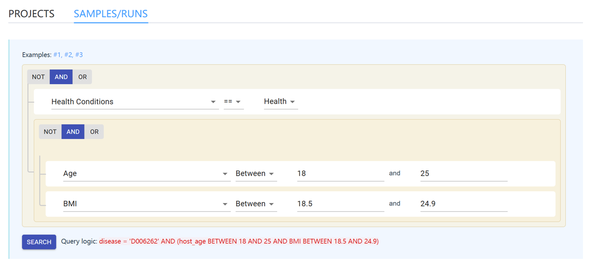

# Website overview

## The Main / Home page

The main containts of the [home page](https://gmrepo2025.humangut.info:8443/home) contain two main sections: 

### 1. brief summary of db contents

This sections contain:

* the main features of **GMrepo**
* main contents of the database and links to the corresponding pages.

### 2. a graphic data selector

A graphic data selector that allows users to construct complex queries to the projects and runs in our database. It consists of two selectors, one is dedicated for searching for <code>samples/runs</code>, the other is for <code>projects</code>.

Below is a screenshot of the selector:

.

The search logic is to find <code>runs/samples</code> that are: 

* related to healthy individuals, <code>AND</code>,
* 18 to 25 years old, <code>AND</code>,
* with healthy BMI from 18.5 to 24.9.

See the [Database usage](../usage/graphicdataselector.md) section for details and more examples.

## Header bar / navigation bar

The header bar is the most important widget of  **GMrepo**.

It is fixed to the top so it is placed at the top of windows.

<!--It plays three major roles, navigation and global search. See the screenshot below:

 -->
It plays two major roles, See the screenshot below:

### 1. Logo

It displays a logo of **GMrepo**. Users can click this logo and navigate back to the [home page](https://gmrepo2025.humangut.info:8443/home).
<!--
### 2. Global search

It contains a global search widget that allows users to enter <code>keywords</code> of interests, shows the search results in a dropdown list, and allow users to click and go to the corresponding page in our database.

For example, users can use it to find any of the following entries in our database:

* projects,
* samples,
* runs,
* gut microbes, 
* marker microbes, 
* diseases and 
* disease-health comparisons

!!! note
    * The search is automatic when users enter three and more characters, i.e., the search results (if there is any) will be shown automatically as users type. It is thus no need to press the "enter" key.
    
    * The wideget does not show anything if no matches are found in the database.

Please consult the help pages in the "Database usage" section for details.
-->
### 2. Menu items / navigation items

This section contains menu and sub-menu items that allow users to navigate through the main contents of **GMrepo**.

These (sub)menu items include:

* Home: navigate back to the [home page](https://gmrepo2025.humangut.info:8443/home).
* Phenotypes: mouse over or click to show two sub-menus:
    * All phenotypes: go to the [List of diseases and their associated gut microbes](https://gmrepo2025.humangut.info:8443/phenotypes).
    * Phenotype comparisons: contains a list of disease-health or disease-disease comparisons for which [microbial markers have been identified](https://gmrepo2025.humangut.info:8443/phenotypes/comparisons).
* Taxa: contains two sub-menus:
    * All taxa: list and characterisations of [gut microbes](https://gmrepo2025.humangut.info:8443/taxon) at species and genus levels identified from all qualified samples;
    * Marker taxa: list and distribution of [marker taxa](https://gmrepo2025.humangut.info:8443/taxon/marker) at species and genus levels identified from curated projects.
* Data: contains two submenus:
    * All projects and runs: lists of [projects, runs and related metadata](https://gmrepo2025.humangut.info:8443/data),
    * Curated projects: a list of [curated projects](https://gmrepo2025.humangut.info:8443/data/curatedProjects).
* Help: link to this documentation.

## Footer

The footer shows at the bottom of all pages and contains copyright information and links to  
[contact information](#contact-information),  
[Our latest publication](https://doi.org/10.1093/nar/gkab1019).

## Contact information

This database is a collaboration by:

* [Chen Lab at Huazhong University of Science and Technology (HUST)](http://chenlab.medgenius.info/),
* [Zhao Lab at Fudan University](http://comp-sysbio.org/), and
* [Ning Lab at HUST](http://life.hust.edu.cn/info/1021/1470.htm).

